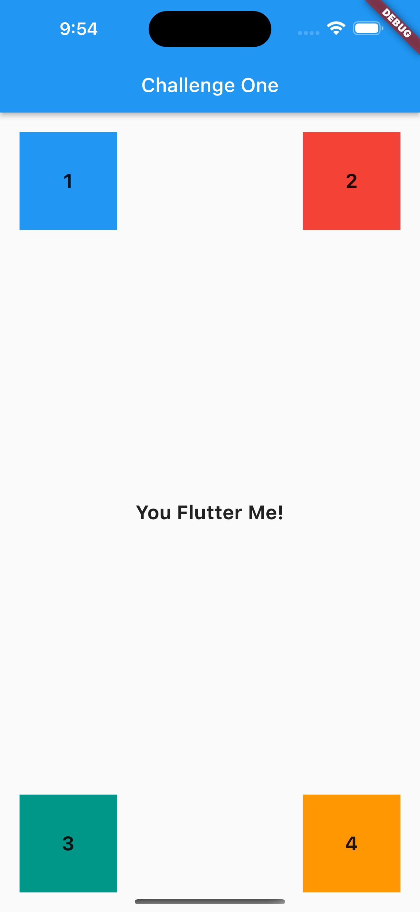
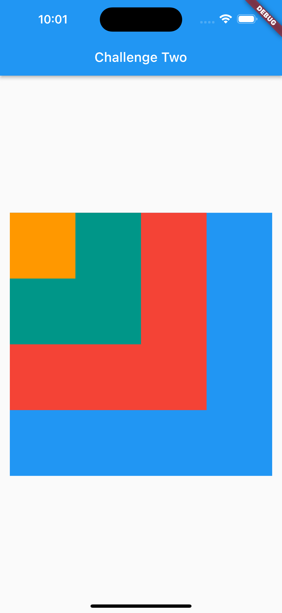
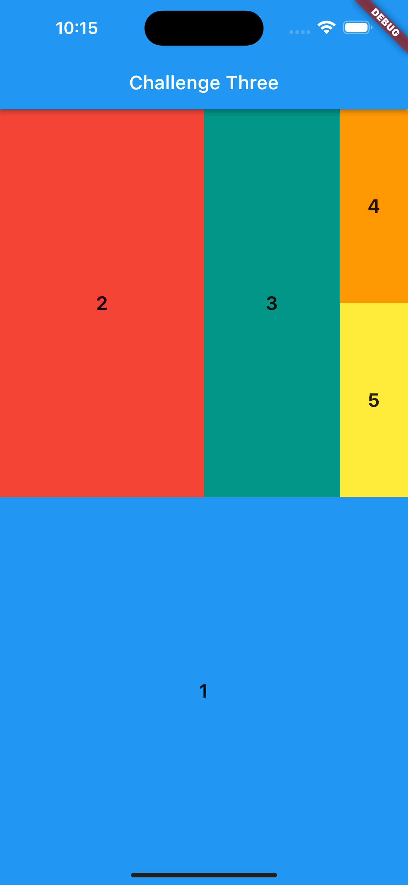

# GDSC-CITU UI Challenge

This is a part of [**You Flutter Me**](https://gdsc.community.dev/events/details/developer-student-clubs-cebu-institute-of-technology-presents-you-flutter-me/) workshop of GDSC - Cebu Institute of Technology.

## Output

This is the final output of all challenges:

<table>
  <tr>
    <td align="center">
        
    </td>
    <td align="center">
        
    </td>
    <td align="center">
        
    </td>
  </tr>
</table>

## Getting Started

This project is a starting point for a Flutter application.

A few resources to get you started if this is your first Flutter project:

- [Lab: Write your first Flutter app](https://docs.flutter.dev/get-started/codelab)
- [Cookbook: Useful Flutter samples](https://docs.flutter.dev/cookbook)

For help getting started with Flutter development, view the
[online documentation](https://docs.flutter.dev/), which offers tutorials,
samples, guidance on mobile development, and a full API reference.
